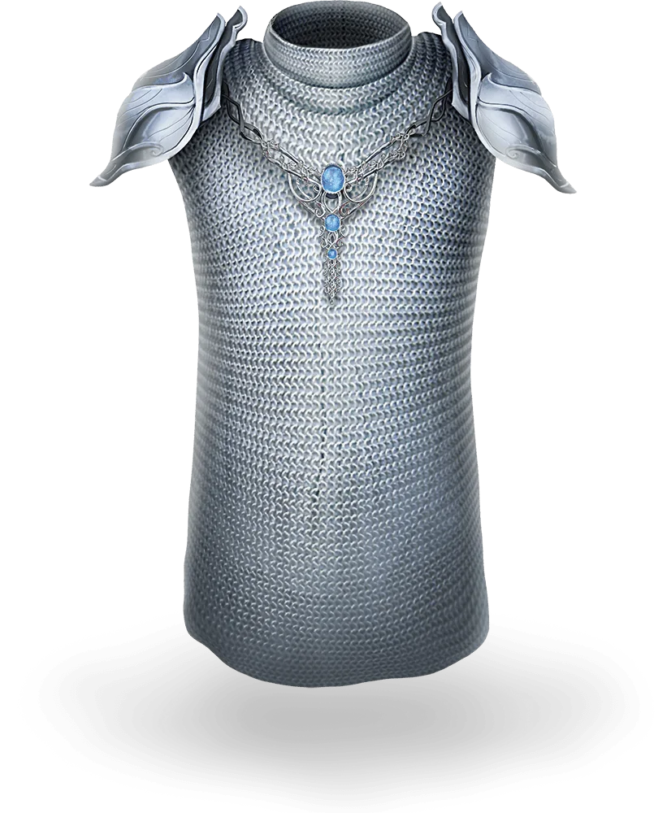

# Elfenrüstung
*Rüstung ([[Kettenhemd-phb|Kettenhemd]]), selten*

- **Rüstungsklasse**: 14 + GES (max +2)
- **Gewicht:** 10,0 kg

Du erhältst einen Bonus von +1 auf deine Rüstungsklasse, während du diese Rüstung trägst. Du bist mit dieser Rüstung geübt, selbst wenn dir die Übung für mittelschwere Rüstung fehlt.

*Source: Dungeon Master's Guide p. 168. Available in the SRD*